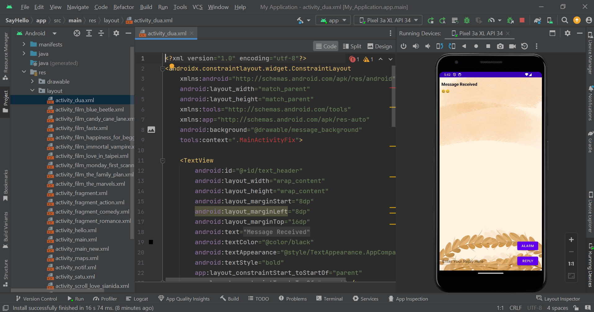

# Project-Mobile-App
This Project For UAS Pemograman Mobile

|**Nama**|**NIM**|**Kelas**|**Matkul**|
|----|---|-----|------|
|Muhammad Fiqri Setyoadi|312210062|TI.22.A.2|Pemograman Mobile|

## Here is a *brief* *explanation*

- Membuat animasi splash terlebih dahulu supaya pas ngebuka aplikasinya tampak keren.
    
    untuk melihat **codenya** ***[klik disini](layout/activity_splash.xml)***

    ***Ouputnya:***
    

- Kemudian kita membuat activity halaman utama pada aplikasi kita.

    untuk melihat **codenya** ***[klik disini](layout/activity_main.xml)***

    ***Ouputnya:***
    

- **Button Hello.**

    untuk melihat **codenya** ***[klik disini](layout/activity_hello.xml)***

    ***Ouputnya:***
    

- **button Count.**

    untuk melihat **codenya** ***[klik disini](layout/activity_notif.xml)***

    ***Ouputnya:***
    

- **Button Kasus Sianida**

    untuk melihat **codenya** ***[klik disini](layout/activity_scroll_love_sianida.xml)***

    ***Ouputnya:***
    

- **Button Message**

    untuk melihat **codenya** ***[klik disini](layout/activity_satu.xml)***, ini adalah ketika sebelum terkirim.

    ***Ouputnya:***
    

    untuk melihat **codenya** ***[klik disini](layout/activity_dua.xml)***, ini adalah ketika sudah terkirim.

    ***Ouputnya:***
    

- **Button Alarm.**

    untuk melihat **codenya** ***[klik disini](myapplication/AlarmReceiver.java)***

    ***Ouputnya:***
        

- **Button Maps.**

    untuk melihat **codenya** ***[klik disini](layout/activity_maps.xml)*** 

    ***Ouputnya:***
    

- **Button Film**
    
    Pertama-tama kita buat fragment untuk 3 menu yaitu (Action, Comedy, dan Romance).

    untuk melihat **codenya** ***[klik disini](layout/activity_fragment.xml)***

    ***Ouputnya:***
    

    - **Bagian Action**
        
        untuk melihat **codenya** ***[klik disini](layout/activity_fragment_action.xml)***

        ***Ouputnya:***
        

    - **Bagian Comedy**
        
        untuk melihat **codenya** ***[klik disini](layout/activity_fragment_comedy.xml)*** 

        ***Ouputnya:***
        

    - **Bagian Romance**

        untuk melihat **codenya** ***[klik disini](layout/activity_fragment_romance.xml)***

        ***Ouputnya:***
        

        - **This is how the video looks like when you click on one of the lists, and I chose The marvels movie.**
        
        ***Ouputnya:***
        

## Source Code

- Dikarenakan tidak lengkap Code yang saya Upload ke Github ini, silahkan untuk mengakses Google Drive dibawah ini.

    

    ***[Please DM Me okay](https://drive.google.com/drive/folders/1LjmKhSh5glJN8d7XSmpFmZeOwVi-ZoGw?usp=sharing)***

## THANKS FOR ALL, SALAM MAHASISWA 🎓❤️

